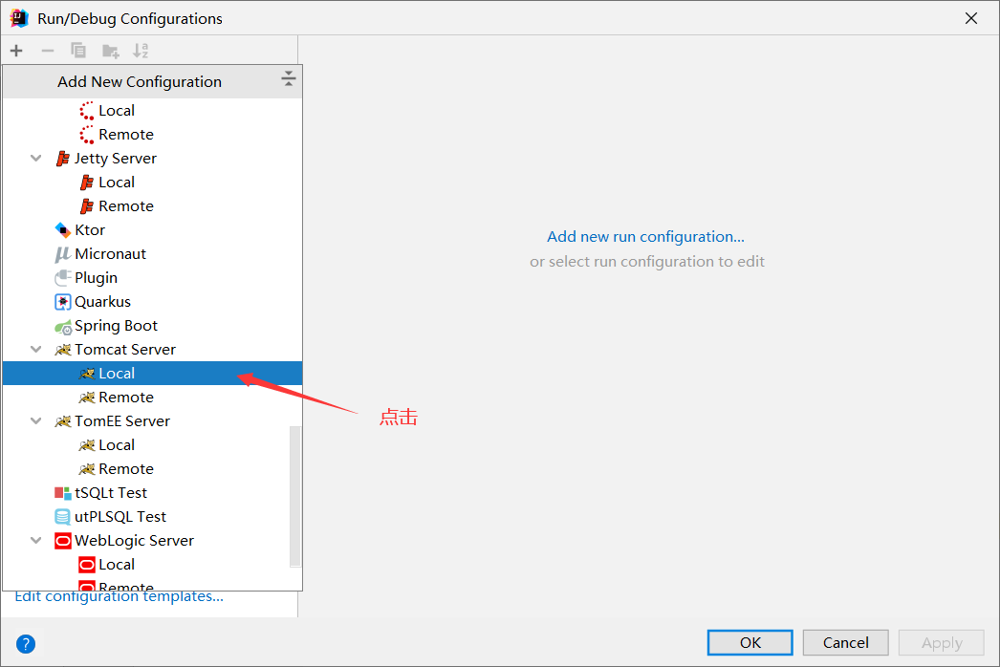

JavaWeb

java、web

## 1、基本概念

### 1.1、 前言

web开发：

- web是网页的意思
- 静态web
  - html css
  - 提供给所有人看的数据，始终不会发生变化
- 动态web
  - 每个人在不同的时间、不同的地点看到的信息不相同
  - 技术栈：Servlet/Jsp，Asp，PHP

java中，动态web资源开发的技术称为javaWeb

### 1.2、 web应用程序

web应用程序：可以提供给浏览器访问的程序

- a.html xx.html......多个web资源整合起来，这些资源可以被外界访问，对外界提供服务
- 我们能访问到的任何一个页面或资源都存在与这个世界的某一个角落的计算机上
- URL
- 这些统一的web资源会被放在同一个文件夹下，web应用程序依赖于 Tomcat
- 一个web应用由多个部分组成(静态web、动态web)
  - html、css、js
  - jsp、servlet
  - java程序
  - jar包
  - 配置文件(properties)

web应用程序编写完毕后，若想提供给外界访问：需要一个服务器来统一管理；

### 1.3、静态web

- *.htm
- *.html


- 静态web的缺点
  - web页面无法动态刷新，所有用户看到的都是同一个页面，可用以下方法改进
    - 轮播图
    - 点击特效：伪动态
    - JavaScript
  - 无法和数据库交互(数据无法持久化，用户无法交互)

### 1.4、动态web

页面会动态展示：因人而异


**缺点**

- 加入服务器的动态资源出现了错误，我们需要从新编写**后台程序**，重新发布
  - 停机维护

**优点**

- web页面可以动态刷新，所有用户看到的不都是同一个页面
- 可以与数据库交互(数据持久化)
  - 


## 2、web服务器

### 2.1、三个技术

> ASP

- 微软：国内最早流行的
- 在html中嵌入了VB的脚本 ASP + COM
- 在ASP开发中，基本一个页面都有几千行的业务代码 --> 维护成本高
- 主要用C#
- IIS

> PHP

- PHP开发速度很快，功能很强大，跨平台，代码简单
- 无法承载大访问量的情况（局限性）

> JSP/Servlet

B/S: 浏览器和服务器

C/S: 客户端和服务器

- sun公司主推的B/S架构
- 基于Java语言
- 可以承载三高问题带来的影响

### 2.2、web服务器

服务器是一种被动的操作，用来处理用户的一些请求以及给用户一些响应

**IIS**

- 微软的
- 跑ASP
- Windows中自带的

**Tomcat**

> Tomcat是Apache 软件基金会（Apache Software Foundation）的Jakarta 项目中的一个核心项目，最新的Servlet 和JSP 规范总是能在Tomcat 中得到体现，因为Tomcat 技术先进、性能稳定，而且**免费**，因而深受Java 爱好者的喜爱并得到了部分软件开发商的认可，成为比较流行的Web 应用服务器。
>
> Tomcat 服务器是一个免费的开放源代码的Web 应用服务器，属于轻量级应用[服务器](https://baike.baidu.com/item/服务器)，在中小型系统和并发访问用户不是很多的场合下被普遍使用，是开发和调试JSP 程序的首选。对于一个Java初学web者来说，它是最佳首选
>
> Tomcat 实际上运行JSP 页面和Servlet。Tomcat最新版本为**10.0.14**。

下载Tomcat

1. 安装
2. 了解配置文件及目录结构
3. 作用

## 3、Tomcat

### 3.1、安装Tomcat

[Tomcat官网](https://tomcat.apache.org/)


注：tar.gz是Linux下的安装包


右击解压


### 3.2、Tomcat启动

文件夹的作用


**启动关闭Tomcat**

> 启动


双击此文件运行

浏览器url地址栏输入 localhost:8080/ 回车

若成功，会看到以下页面


> 关闭

1. 直接关闭Tomcat的窗口
2. 

可能遇到的问题

- Java环境变量没有配置
- 闪退问题：需要配置兼容性
- 乱码问题：配置文件中设置


### 3.3、Tomcat配置

> 修改启动端口.....


在该文件夹中修改启动的端口号，主机名...

可配置的端口

- Tomcat的默认端口号是8080
- mysql：3306
- http: 80
- https：443

```xml
<Connector port="8080" protocol="HTTP/1.1"
               connectionTimeout="20000"
               redirectPort="8443" />
```

可以配置的主机名称

- 默认的是localhost-->127.0.0.1
- 默认的网站应用存放位置为webapps文件夹

```xml
 <Host name="localhost"  appBase="webapps"
            unpackWARs="true" autoDeploy="true">
```

但是在此修改的name访问不成功

需要以下做法

例如:

1. 将name="www.qinjiang.com"

2. 修改Windows中的host


重启一下Tomcat


> 修改主页信息


在这里可以修改访问主页的信息

```jsp
<div id="navigation" class="curved container">
                <span id="nav-home"><a href="${tomcatUrl}">Home</a></span>
                <span id="nav-hosts"><a href="${tomcatDocUrl}">Documentation</a></span>
                <span id="nav-config"><a href="${tomcatDocUrl}config/">Configuration</a></span>
                <span id="nav-examples"><a href="${tomcatExamplesUrl}">Examples</a></span>
                <span id="nav-wiki"><a href="https://wiki.apache.org/tomcat/FrontPage">Wiki</a></span>
                <span id="nav-lists"><a href="${tomcatUrl}lists.html">Mailing Lists</a></span>
                <span id="nav-help"><a href="${tomcatUrl}findhelp.html">Find Help</a></span>
                <br class="separator" />
</div>
```


**网站是如何进行访问的**

1. 输入URL 回车

2. 检查本机的C:\Windows\System32\drivers\etc下的hosts配置文件下是否有这个**域名的映射**

   1. 若有，直接返回对应的ip地址，这个地址中有我们需要访问的web程序，可以直接访问

      ```java
      127.0.0.1 www.qinjiang.com
      ```

   2.  若没有，去DNS服务器上找，找到就返回，找不到就返回找不到

      


### 3.4、发布一个web网站

1. 将自己写的网站放在Tomcat服务器的指定的文件夹(webapps)下面

   

   每一个文件夹对应 localhost:8080/文件夹名

   网站的结构

   > ---webapps
   >
   > ​	--- root
   >
   > ​	--- scy ：网站的目录名
   >
   > ​		---WEB-INFO
   >
   > ​			---classes ：java程序
   >
   > ​			---lib ：web引用所依赖的jar包
   >
   > ​			---web.xml ：网站配置文件
   >
   > ​		---index.html ：默认的首页
   >
   > ​		---static ：静态资源
   >
   > ​			---css
   >
   > ​				---**.css
   >
   > ​			---js
   >
   > ​			---images
   >
   > ​		---...

   

## 4、http

### 4.1、什么是http

超文本传输协议（Hyper Text Transfer Protocol，HTTP）是一个简单的请求-响应协议，它通常运行在TCP之上。

- 文本 html 字符串 ....
- 超文本
  - 图片
  - 音乐
  - 视频
  - 定位
  - 地图
- 端口 80

HTTPS （全称：Hyper Text Transfer Protocol over SecureSocket Layer），是以安全为目标的 HTTP 通道，在HTTP的基础上通过传输加密和身份认证保证了传输过程的安全性  。

- 端口443


### 4.2、http的两个时代

- http1.0
  - HTTP/1.0：客户端可以与web服务器的连接后，只能获取一个web资源，断开连接
- http2.0
  - HTTP/1.1：客户端可以与web服务器的连接后，可以获取多个web资源


### 4.3、http请求

- 客户端发请求(Request)到服务器

百度

General

```java
Request URL: https://www.baidu.com/ //请求地址
Request method: GET //请求方法
Status code: 200 OK //状态码
Remote address: 14.215.177.39:443  //远程地址
```

Request header

```java
Accept: text/html //类型
Accept-Encoding: gzip, deflate, br //类型编码
Accept-Language: zh-CN,zh;q=0.9 //语言
Cache-Control: max-age=0 //cache控制
Connection: keep-alive //连接
```

#### 请求行

- 请求行中的方式 GET
- 请求方式：**GET、POST**、HEAD、DELETE、PUT、TRACT
  - get 一次请求能携带的参数比较少，大小有限制，会在浏览器的URL栏显示内容，但是高效
  - post 一次请求能携带的参数比较多，大小无限制，不会在浏览器的URL显示内容，但是不高效

#### 消息头

```java
Accept //告诉浏览器他所支持的数据类型
Accept-Encoding //告诉浏览器支持的编码格式 GBK UTF-8 GB2312
Accept-Language //告诉浏览器他的语言环境
Cache-Control //缓存控制
Connection //告诉浏览器，请求完是断开还是保持连接
Host //主机
```


### 4.4、http响应

- 服务器回一个响应到客户端

百度

Response header

```java
Cache-Control: private //cache缓存控制
Connection: keep-alive //连接：保持连接
Content-Encoding: gzip  //编码
Content-Type: text/html;charset=utf-8 //类型
```

#### 响应体

```java
Accept //告诉浏览器他所支持的数据类型
Accept-Encoding //告诉浏览器支持的编码格式 GBK UTF-8 GB2312
Accept-Language //告诉浏览器他的语言环境
Cache-Control //缓存控制
Connection //告诉浏览器，请求完是断开还是保持连接
Host //主机
Refresh //告诉客户端多久刷新
Location //让网页重新定位
```

#### 响应状态码

- 200 请求响应成功
- 3xx 请求重定向
  - 重定向：你重新到我给你的新位置
- 4xx 找不到资源-404
  - 资源不存在
- 5xx服务器代码错误-500
  - 502 网关错误


常见面试题：

当你的浏览器中地址栏输入地址并按回车的一瞬间 到 页面能够展示回来，经历了什么？


## 5、Maven

**为什么学Maven？**

1. 在Javaweb中，我们需要大量的jar包，需要我们手动去导入
2. Maven可以自动帮我们导入和配置jar包


#### 5.1、Maven架构管理工具

我们目前用它就是来导入jar包

Maven的**核心**思想：**约定大于配置**

- 有约束 不要违反
- Maven会规定你该如何去编写我们的Java代码

#### 5.2、Maven下载

官网：https://maven.apache.org/


解压


#### 5.3、配置环境变量

在**系统环境变量**中 如下配置

- M2_HOME  maven目录下的bin目录
- MAVEN_HOME maven的目录

在系统的path中配置我们的 MAVEN_HOME %MAVEN_HOME%\bin


path中也加入


测试是否配置成功


#### 5.4、阿里云镜像

- mirrors：镜像
  - 作用：加速我们的下载
- 国内建议使用阿里云镜像 maven3.8.4自带，不建议修改

```xml
<mirror>
    <id>nexus-aliyun</id>
    <mirrorOf>*,!jeecg,!jeecg-snapshots</mirrorOf>
    <name>Nexus aliyun</name>
    <url>http://maven.aliyun.com/nexus/content/groups/public</url>
</mirror>
```


#### 5.5、建立本地仓库

本地仓库

远程仓库

建一个本地仓库**localRepository**


新建一个本地文件夹


E:\environment\apache-maven-3.8.4\maven-repo

在conf文件夹下的 settings.xml中添加本地仓库位置(此处用的notepad软件，没有的话 右击，记事本打开)


#### 5.6、在idea中使用Maven

1. 启动idea

2. 创建一个MavenWeb项目

   

3. 

​		点击next


 然后设置项目文件所在地址，finish

之后等待下载配置文件


3. idea创建成功后 我们要注意

​	


4. 到这里 idea导入maven就ok了


#### 5.7、创建一个普通的maven项目

不勾选 直接next


在上面webapp的情况下


在上面webapp的项目中 仿照干净的maven项目，新建java resources


#### 5.8、在idea中标记文件夹功能

如果你上述的java resources和我的不一致

以java为例 右击java


**或者** file--project-structure-modules下面的sources也可以设置


#### 5.9、在idea中配置Tomcat

1、





点击ok


#### 5.10、pom文件

pom.xml是Maven的核心配置文件


pom文件详解

```xml
<?xml version="1.0" encoding="UTF-8"?>

<!--Maven版本以及头文件-->
<project xmlns="http://maven.apache.org/POM/4.0.0" xmlns:xsi="http://www.w3.org/2001/XMLSchema-instance"
  xsi:schemaLocation="http://maven.apache.org/POM/4.0.0 http://maven.apache.org/xsd/maven-4.0.0.xsd">
  <modelVersion>4.0.0</modelVersion>

  <!--这里就是我们刚才配置的GVA-->
  <groupId>com.si</groupId>
  <artifactId>javaweb-01-maven</artifactId>
  <version>1.0-SNAPSHOT</version>
  <!--项目的打包方式
  jar包 -java应用
  war包 -javaweb应用
  -->
  <packaging>war</packaging>


  <!--配置-->
  <properties>
    <!--项目的默认构建编码-->
    <project.build.sourceEncoding>UTF-8</project.build.sourceEncoding>
    <!--maven的编译版本-->
    <maven.compiler.source>1.7</maven.compiler.source>
    <maven.compiler.target>1.7</maven.compiler.target>
  </properties>

  <!--项目依赖-->
  <dependencies>
    <!--具体依赖的jar包-->
    <dependency>
      <groupId>junit</groupId>
      <artifactId>junit</artifactId>
      <version>4.11</version>
      <scope>test</scope>
    </dependency>
  </dependencies>

  <!--项目构建用的东西-->
  <build>
    <finalName>javaweb-01-maven</finalName>
    <pluginManagement><!-- lock down plugins versions to avoid using Maven defaults (may be moved to parent pom) -->
      <plugins>
        <plugin>
          <artifactId>maven-clean-plugin</artifactId>
          <version>3.1.0</version>
        </plugin>
        <!-- see http://maven.apache.org/ref/current/maven-core/default-bindings.html#Plugin_bindings_for_war_packaging -->
        <plugin>
          <artifactId>maven-resources-plugin</artifactId>
          <version>3.0.2</version>
        </plugin>
        <plugin>
          <artifactId>maven-compiler-plugin</artifactId>
          <version>3.8.0</version>
        </plugin>
        <plugin>
          <artifactId>maven-surefire-plugin</artifactId>
          <version>2.22.1</version>
        </plugin>
        <plugin>
          <artifactId>maven-war-plugin</artifactId>
          <version>3.2.2</version>
        </plugin>
        <plugin>
          <artifactId>maven-install-plugin</artifactId>
          <version>2.5.2</version>
        </plugin>
        <plugin>
          <artifactId>maven-deploy-plugin</artifactId>
          <version>2.8.2</version>
        </plugin>
      </plugins>
    </pluginManagement>
  </build>
</project>

```


maven由于其约定大于配置的思想，之后我们可能会遇到我们写的配置文件，无法被导出或者生效的问题，解决方案：**配置resource节点**

```xml
<!--在build中配置resources,来防止我们资源导出失败的问题-->
    <build>
        <resources>
            <resource>
                <directory>src/main/resources</directory>
                <excludes>
                    <exclude>**/*.properties</exclude>
                    <exclude>**/*.xml</exclude>
                </excludes>
                <filtering>false</filtering>
            </resource>
            <resource>
                <directory>src/main/java</directory>
                <includes>
                    <include>**/*.properties</include>
                    <include>**/*.xml</include>
                </includes>
                <filtering>false</filtering>
            </resource>
        </resources>
    </build>
```

#### 5.11、idea操作 目录树


#### 5.12、Maven repository的使用

地址：https://mvnrepository.com/

使用例子 以servlet-api 为例


## 6、Servlet

### 6.1、servlet简介

- 是sun公司开发动态web的一门技术
- sun公司在这些API中提供了一个接口--servlet
- 如果你想开发一个servlet小程序，只需要完成两步
  - 编写一个类 实现servlet接口
  - 把开发好的java类 部署到web服务器

**把实现了servlet接口的Java代码叫做servelet**

### 6.2、HelloServlet

Servlet在sun公司有两个实现接口：HTTPServlet，GenericServlet

1. 构建一个Maven项目 删掉里面的src目录，以后我们的学习就要在这里建module，这个空的工程就是Maven的主工程

   

新建子模块


2. 关于Maven父子工程的理解

   1. 父项目中的pom中有个mudule

      ```xml
      <modules>
        	<module>servlet-01</module>
      </modules>
      ```

   2. 子项目中的pom有parent (如果你的没有的话，要先删除父项目pom中scope删除)

      ```xml
      <parent>
          <artifactId>javaweb-02-Servlet</artifactId>
          <groupId>com.si</groupId>
          <version>1.0-SNAPSHOT</version>
        </parent>
      ```

​	son项目可以用father项目的jar包

3. Maven环境优化

   1. 修改web.xml为最新版本apache-tomcat-10.0.14\webapps\ROOT\WEB-INF中的格式
   2. 将Maven的结构搭建完整

4. 新建一个servlet程序

   1. 编写一个普通类

   2. 实现Servlet接口，继承HTTPServlet

      ```java
      package com.si.servlet;
      
      import javax.servlet.ServletException;
      import javax.servlet.http.HttpServlet;
      import javax.servlet.http.HttpServletRequest;
      import javax.servlet.http.HttpServletResponse;
      import java.io.IOException;
      import java.io.PrintWriter;
      
      public class HelloServlet extends HttpServlet {
          //由于Get Post只是请求实现的不同方式，可以相互调用，业务逻辑都一样
      
          @Override
          protected void doGet(HttpServletRequest req, HttpServletResponse resp) throws ServletException, IOException {
      
              PrintWriter writer = resp.getWriter(); //响应流
              writer.print("Hello Servlet");
          }
      
          @Override
          protected void doPost(HttpServletRequest req, HttpServletResponse resp) throws ServletException, IOException {
              doGet(req, resp);
          }
      }
      ```

5. 编写Servlet的mapping映射

   为什么我们需要映射？

   因为我们写的是java程序，需要通过浏览器来访问，而浏览器需要访问web服务器，所以我们要在web服务器中注册我们写的Servlet程序，并且给他一个浏览器能访问的映射

   在web.xml中注册

   ```xml
   <?xml version="1.0" encoding="UTF-8"?>
   <web-app xmlns="https://jakarta.ee/xml/ns/jakartaee"
            xmlns:xsi="http://www.w3.org/2001/XMLSchema-instance"
            xsi:schemaLocation="https://jakarta.ee/xml/ns/jakartaee
                         https://jakarta.ee/xml/ns/jakartaee/web-app_5_0.xsd"
            version="5.0"
            metadata-complete="true">
   
       <!--注册Servlet-->
       <servlet>
           <servlet-name>hello</servlet-name>
           <servlet-class>com.si.servlet.HelloServlet</servlet-class>
       </servlet>
       <!--Servlet的请求路径-->
       <servlet-mapping>
           <servlet-name>hello</servlet-name>
           <url-pattern>hello</url-pattern>
       </servlet-mapping>
   
   </web-app>
   ```

6. 配置Tomcat

​		注意配置的项目发布路径

7. 启动测试


### 6.3、Servlet原理

servlet是由web服务器调用的，web服务器在收到浏览器请求后，会


### 6.4、Mapping

1. 一个Servlet可以指定**一个**映射路径

   ```xml
   <!--Servlet的请求路径-->
   <servlet-mapping>
       <servlet-name>hello</servlet-name>
       <url-pattern>/hello</url-pattern>
   </servlet-mapping>
   ```

2. 一个Servlet可以指定**多个**映射路径

   ```xml
   <!--Servlet的请求路径-->
   <servlet-mapping>
       <servlet-name>hello</servlet-name>
       <url-pattern>/hello</url-pattern>
   </servlet-mapping>
   
   <servlet-mapping>
       <servlet-name>hello</servlet-name>
       <url-pattern>/hello1</url-pattern>
   </servlet-mapping>
   ```

3. 一个Servlet可以指定**通用**映射路径

   ```xml
   <servlet-mapping>
       <servlet-name>hello</servlet-name>
       <url-pattern>/hello/*</url-pattern>
   </servlet-mapping>
   
   <!--默认请求路径-->
   <servlet-mapping>
       <servlet-name>hello</servlet-name>
       <url-pattern>/*</url-pattern>
   </servlet-mapping>
   ```

4. 指定一些前缀后缀等等

   ```xml
   <!--Servlet的请求路径-->
   <!--只要.scy都能访问到 /hello/sssss.scy也能访问到
    *前面不能加项目映射路径
   -->
   <servlet-mapping>
       <servlet-name>hello</servlet-name>
       <url-pattern>*.scy</url-pattern>
   </servlet-mapping>
   ```

5. 优先级问题

   指定了固有的映射路径优先级最高，如果找不到会走默认的处理请求

   ```xml
   <!--注册默认Servlet请求-->
   <servlet>
       <servlet-name>error</servlet-name>
       <servlet-class>com.si.servlet.ErrorServlet</servlet-class>
   </servlet>
   <!--Servlet的请求路径-->
   <servlet-mapping>
       <servlet-name>error</servlet-name>
       <url-pattern>/*</url-pattern>
   </servlet-mapping>
   ```

### 6.5、ServletContext

web容器在启动的时候，它会为web程序都创建一个servletContext对象，它代表了当前的web应用


#### 6.51、共享数据

我在这个servlet中保存的数据，在另一个servlet中也可以拿到

放置的类

```java
package com.si.servlet;

import javax.servlet.ServletContext;
import javax.servlet.ServletException;
import javax.servlet.http.HttpServlet;
import javax.servlet.http.HttpServletRequest;
import javax.servlet.http.HttpServletResponse;
import java.io.IOException;

public class HelloServlet extends HttpServlet {
    @Override
    protected void doGet(HttpServletRequest req, HttpServletResponse resp) throws ServletException, IOException {

        //this.getInitParameter() 获取初始化参数
        //this.getServletConfig() 获取servlet配置
        //this.getServletContext() 获取servlet上下文

        ServletContext servletContext = this.getServletContext();
        String username = "司称勇"; //数据
        servletContext.setAttribute("username",username); //将一个数据保存在了ServletContext中，名为username,值为username

        System.out.println("hello");
    }

    @Override
    protected void doPost(HttpServletRequest req, HttpServletResponse resp) throws ServletException, IOException {
        doGet(req, resp);
    }
}
```

读取的类

```java
package com.si.servlet;

import javax.servlet.ServletContext;
import javax.servlet.ServletException;
import javax.servlet.http.HttpServlet;
import javax.servlet.http.HttpServletRequest;
import javax.servlet.http.HttpServletResponse;
import java.io.IOException;

public class GetServlet extends HttpServlet {
    @Override
    protected void doGet(HttpServletRequest req, HttpServletResponse resp) throws ServletException, IOException {
        ServletContext servletContext = this.getServletContext();

        String username = (String) servletContext.getAttribute("username");

        resp.setContentType("text/html");
        resp.setCharacterEncoding("utf-8");
        resp.getWriter().print(username);
    }

    @Override
    protected void doPost(HttpServletRequest req, HttpServletResponse resp) throws ServletException, IOException {
        doGet(req, resp);
    }
}
```

​		配置web.xml

```xml
    <servlet>
        <servlet-name>hello</servlet-name>
        <servlet-class>com.si.servlet.HelloServlet</servlet-class>
    </servlet>
    
    <servlet-mapping>
        <servlet-name>hello</servlet-name>
        <url-pattern>/hello</url-pattern>
    </servlet-mapping>

    <servlet>
        <servlet-name>getc</servlet-name>
        <servlet-class>com.si.servlet.GetServlet</servlet-class>
    </servlet>

    <servlet-mapping>
        <servlet-name>getc</servlet-name>
        <url-pattern>/getc</url-pattern>
    </servlet-mapping>
```

#### 6.52、获取初始化参数

```xml
<!--配置初始化参数-->
    <context-param>
        <param-name>url</param-name>
        <param-value>jdbc:mysql://localhost:3306/mybaits</param-value>
    </context-param>
```

获取初始化参数

```java
package com.si.servlet;

import javax.servlet.ServletContext;
import javax.servlet.ServletException;
import javax.servlet.http.HttpServlet;
import javax.servlet.http.HttpServletRequest;
import javax.servlet.http.HttpServletResponse;
import java.io.IOException;

public class ServletDemo03 extends HttpServlet {
    @Override
    protected void doGet(HttpServletRequest req, HttpServletResponse resp) throws ServletException, IOException {

        //this.getInitParameter() 获取初始化参数
        //this.getServletConfig() 获取servlet配置
        //this.getServletContext() 获取servlet上下文

        ServletContext servletContext = this.getServletContext();
        String url = servletContext.getInitParameter("url");

        resp.getWriter().print(url);

    }

    @Override
    protected void doPost(HttpServletRequest req, HttpServletResponse resp) throws ServletException, IOException {
        doGet(req, resp);
    }
}
```

注册servlet

```xml
<servlet>
        <servlet-name>gp</servlet-name>
        <servlet-class>com.si.servlet.ServletDemo03</servlet-class>
    </servlet>

    <servlet-mapping>
        <servlet-name>gp</servlet-name>
        <url-pattern>/gp</url-pattern>
    </servlet-mapping>
```

#### 6.53、请求转发


```java
 @Override
    protected void doGet(HttpServletRequest req, HttpServletResponse resp) throws ServletException, IOException {

        //this.getInitParameter() 获取初始化参数
        //this.getServletConfig() 获取servlet配置
        //this.getServletContext() 获取servlet上下文

        System.out.println("进入了servletDemo04");
        ServletContext servletContext = this.getServletContext();
        /* 分开写
        RequestDispatcher requestDispatcher = servletContext.getRequestDispatcher("/gp"); //转发的请求路径
        requestDispatcher.forward(req,resp); //调用forward实现请求转发
        */
        servletContext.getRequestDispatcher("/gp").forward(req,resp);
    }
```

#### 6.54、读取资源文件

properties

- 在java下创建properties
- 在resources下创建properties

发现都被打包到了同一个路径下(classes 我们俗称为classpath)


properties文件

```properties
username=root
password=123456
```

```java
protected void doGet(HttpServletRequest req, HttpServletResponse resp) throws ServletException, IOException {

        ServletContext servletContext = this.getServletContext();
        InputStream resourceAsStream = servletContext.getResourceAsStream("/WEB-INF/classes/db.properties");//读取资源
        Properties properties = new Properties();
        properties.load(resourceAsStream); //加载资源内容

        System.out.println("账户" + properties.get("username") + "密码" + properties.get("password"));

    }
```

注册servlet

```xml
<servlet>
        <servlet-name>sd5</servlet-name>
        <servlet-class>com.si.servlet.ServletDemo05</servlet-class>
    </servlet>

    <servlet-mapping>
        <servlet-name>sd5</servlet-name>
        <url-pattern>/sd5</url-pattern>
    </servlet-mapping>
```


### 6.6、(HttpServlet)Request

(HttpServlet)Request代表客户端的请求，用户通过Http协议访问服务器，Http请求中的所有信息会被封装到HttpServletRequest，通过这个HttpServletRequest方法，获取客户端所有信息


#### 6.61、获取前端传递的信息 请求转发


```java
package com.si.servlet;

import javax.servlet.ServletException;
import javax.servlet.http.HttpServlet;
import javax.servlet.http.HttpServletRequest;
import javax.servlet.http.HttpServletResponse;
import java.io.IOException;
import java.util.Arrays;

public class LoginServlet extends HttpServlet {
    @Override
    protected void doGet(HttpServletRequest req, HttpServletResponse resp) throws ServletException, IOException {
        doPost(req, resp);
    }

    @Override
    protected void doPost(HttpServletRequest req, HttpServletResponse resp) throws ServletException, IOException {

        //后台接受中文乱码问题
        req.setCharacterEncoding("UTF-8");
        //前台中文乱码
        resp.setCharacterEncoding("UTF-8");

        String username = req.getParameter("username");
        String password = req.getParameter("password");
        String[] hobbies = req.getParameterValues("hobby"); //获取多个值， 多选框


        System.out.println("username:" + username + "\t password:" + password + "\nhobbies:" + Arrays.toString(hobbies));
        //重定向
        //resp.sendRedirect("/r2/success.jsp");

        //请求转发的时候 这里的/代表当前web应用，所以不用加/r2
        req.getRequestDispatcher("/success.jsp").forward(req,resp);
    }
}

```


面试题：**重定向与转发的关系**

- 相同点
  - 页面跳转
- 不同点
  - 请求转发的时候URL不会变化 307
  - 重定向的时候URL会变化 302

### 6.7、(HttpServlet)Response

web服务器接收到客户端的http请求，针对这个请求，分别创建一个代表请求的HttpServletRequest对象和一个代表响应的HttpServletResponse请求

- 获取从客户端请求过来的参数 HttpServletRequest
- 如果要给客户端响应一些信息 HttpServletResponse

#### 6.71、简单分类

> 负责向浏览器发送数据的方法

```java
getOutputStreampublic ServletOutputStream getOutputStream() throws IOException;

public PrintWriter getWriter() throws IOException;
```

> 负责向浏览器发送响应头的方法

```java
public void setCharacterEncoding(String charset);
public void setContentLength(int len);
public void setContentLengthLong(long len);
public void setContentType(String type);
public void setDateHeader(String name, long date);
public void addDateHeader(String name, long date);
public void setHeader(String name, String value);
public void addHeader(String name, String value);
public void setIntHeader(String name, int value);
public void addIntHeader(String name, int value);
```

> 响应的状态码

```java

    /**
     * Status code (100) indicating the client can continue.
     */
    public static final int SC_CONTINUE = 100;

    /**
     * Status code (101) indicating the server is switching protocols
     * according to Upgrade header.
     */
    public static final int SC_SWITCHING_PROTOCOLS = 101;

    /**
     * Status code (200) indicating the request succeeded normally.
     */
    public static final int SC_OK = 200;

    /**
     * Status code (201) indicating the request succeeded and created
     * a new resource on the server.
     */
    public static final int SC_CREATED = 201;

    /**
     * Status code (202) indicating that a request was accepted for
     * processing, but was not completed.
     */
    public static final int SC_ACCEPTED = 202;

    /**
     * Status code (203) indicating that the meta information presented
     * by the client did not originate from the server.
     */
    public static final int SC_NON_AUTHORITATIVE_INFORMATION = 203;

    /**
     * Status code (204) indicating that the request succeeded but that
     * there was no new information to return.
     */
    public static final int SC_NO_CONTENT = 204;

    /**
     * Status code (205) indicating that the agent <em>SHOULD</em> reset
     * the document view which caused the request to be sent.
     */
    public static final int SC_RESET_CONTENT = 205;

    /**
     * Status code (206) indicating that the server has fulfilled
     * the partial GET request for the resource.
     */
    public static final int SC_PARTIAL_CONTENT = 206;

    /**
     * Status code (300) indicating that the requested resource
     * corresponds to any one of a set of representations, each with
     * its own specific location.
     */
    public static final int SC_MULTIPLE_CHOICES = 300;

    /**
     * Status code (301) indicating that the resource has permanently
     * moved to a new location, and that future references should use a
     * new URI with their requests.
     */
    public static final int SC_MOVED_PERMANENTLY = 301;

    /**
     * Status code (302) indicating that the resource has temporarily
     * moved to another location, but that future references should
     * still use the original URI to access the resource.
     *
     * This definition is being retained for backwards compatibility.
     * SC_FOUND is now the preferred definition.
     */
    public static final int SC_MOVED_TEMPORARILY = 302;

    /**
    * Status code (302) indicating that the resource reside
    * temporarily under a different URI. Since the redirection might
    * be altered on occasion, the client should continue to use the
    * Request-URI for future requests.(HTTP/1.1) To represent the
    * status code (302), it is recommended to use this variable.
    */
    public static final int SC_FOUND = 302;

    /**
     * Status code (303) indicating that the response to the request
     * can be found under a different URI.
     */
    public static final int SC_SEE_OTHER = 303;

    /**
     * Status code (304) indicating that a conditional GET operation
     * found that the resource was available and not modified.
     */
    public static final int SC_NOT_MODIFIED = 304;

    /**
     * Status code (305) indicating that the requested resource
     * <em>MUST</em> be accessed through the proxy given by the
     * <code><em>Location</em></code> field.
     */
    public static final int SC_USE_PROXY = 305;

     /**
     * Status code (307) indicating that the requested resource 
     * resides temporarily under a different URI. The temporary URI
     * <em>SHOULD</em> be given by the <code><em>Location</em></code> 
     * field in the response.
     */
    public static final int SC_TEMPORARY_REDIRECT = 307;

    /**
     * Status code (400) indicating the request sent by the client was
     * syntactically incorrect.
     */
    public static final int SC_BAD_REQUEST = 400;

    /**
     * Status code (401) indicating that the request requires HTTP
     * authentication.
     */
    public static final int SC_UNAUTHORIZED = 401;

    /**
     * Status code (402) reserved for future use.
     */
    public static final int SC_PAYMENT_REQUIRED = 402;

    /**
     * Status code (403) indicating the server understood the request
     * but refused to fulfill it.
     */
    public static final int SC_FORBIDDEN = 403;

    /**
     * Status code (404) indicating that the requested resource is not
     * available.
     */
    public static final int SC_NOT_FOUND = 404;

    /**
     * Status code (405) indicating that the method specified in the
     * <code><em>Request-Line</em></code> is not allowed for the resource
     * identified by the <code><em>Request-URI</em></code>.
     */
    public static final int SC_METHOD_NOT_ALLOWED = 405;

    /**
     * Status code (406) indicating that the resource identified by the
     * request is only capable of generating response entities which have
     * content characteristics not acceptable according to the accept
     * headers sent in the request.
     */
    public static final int SC_NOT_ACCEPTABLE = 406;

    /**
     * Status code (407) indicating that the client <em>MUST</em> first
     * authenticate itself with the proxy.
     */
    public static final int SC_PROXY_AUTHENTICATION_REQUIRED = 407;

    /**
     * Status code (408) indicating that the client did not produce a
     * request within the time that the server was prepared to wait.
     */
    public static final int SC_REQUEST_TIMEOUT = 408;

    /**
     * Status code (409) indicating that the request could not be
     * completed due to a conflict with the current state of the
     * resource.
     */
    public static final int SC_CONFLICT = 409;

    /**
     * Status code (410) indicating that the resource is no longer
     * available at the server and no forwarding address is known.
     * This condition <em>SHOULD</em> be considered permanent.
     */
    public static final int SC_GONE = 410;

    /**
     * Status code (411) indicating that the request cannot be handled
     * without a defined <code><em>Content-Length</em></code>.
     */
    public static final int SC_LENGTH_REQUIRED = 411;

    /**
     * Status code (412) indicating that the precondition given in one
     * or more of the request-header fields evaluated to false when it
     * was tested on the server.
     */
    public static final int SC_PRECONDITION_FAILED = 412;

    /**
     * Status code (413) indicating that the server is refusing to process
     * the request because the request entity is larger than the server is
     * willing or able to process.
     */
    public static final int SC_REQUEST_ENTITY_TOO_LARGE = 413;

    /**
     * Status code (414) indicating that the server is refusing to service
     * the request because the <code><em>Request-URI</em></code> is longer
     * than the server is willing to interpret.
     */
    public static final int SC_REQUEST_URI_TOO_LONG = 414;

    /**
     * Status code (415) indicating that the server is refusing to service
     * the request because the entity of the request is in a format not
     * supported by the requested resource for the requested method.
     */
    public static final int SC_UNSUPPORTED_MEDIA_TYPE = 415;

    /**
     * Status code (416) indicating that the server cannot serve the
     * requested byte range.
     */
    public static final int SC_REQUESTED_RANGE_NOT_SATISFIABLE = 416;

    /**
     * Status code (417) indicating that the server could not meet the
     * expectation given in the Expect request header.
     */
    public static final int SC_EXPECTATION_FAILED = 417;

    /**
     * Status code (500) indicating an error inside the HTTP server
     * which prevented it from fulfilling the request.
     */
    public static final int SC_INTERNAL_SERVER_ERROR = 500;

    /**
     * Status code (501) indicating the HTTP server does not support
     * the functionality needed to fulfill the request.
     */
    public static final int SC_NOT_IMPLEMENTED = 501;

    /**
     * Status code (502) indicating that the HTTP server received an
     * invalid response from a server it consulted when acting as a
     * proxy or gateway.
     */
    public static final int SC_BAD_GATEWAY = 502;

    /**
     * Status code (503) indicating that the HTTP server is
     * temporarily overloaded, and unable to handle the request.
     */
    public static final int SC_SERVICE_UNAVAILABLE = 503;

    /**
     * Status code (504) indicating that the server did not receive
     * a timely response from the upstream server while acting as
     * a gateway or proxy.
     */
    public static final int SC_GATEWAY_TIMEOUT = 504;

    /**
     * Status code (505) indicating that the server does not support
     * or refuses to support the HTTP protocol version that was used
     * in the request message.
     */
    public static final int SC_HTTP_VERSION_NOT_SUPPORTED = 505;
```

#### 6.72、下载文件

1. 向浏览器输出消息

2. 下载文件

   1. 获取下载文件的路径
   2. 下载的文件名
   3. 设置想办法让浏览器能够支持下载我们需要的东西
   4. 获取下载文件的输入流
   5. 创建缓冲区
   6. 获取outputstream对象
   7. 将Fileoutputstream写入缓冲区
   8. 使用outputstream将缓冲区的数据输出到客户端

   ```java
   protected void doGet(HttpServletRequest req, HttpServletResponse resp) throws ServletException, IOException {
           //1. 获取下载文件的路径
           String realPath = this.getServletContext().getRealPath("/WEB-INF/classes/images/1.png");
           System.out.println("文件的真实路径：" + realPath);
           //2. 下载的文件名
           String FileName = realPath.substring(realPath.lastIndexOf("\\") + 1);
           System.out.println(FileName);
   
           //3. 设置想办法让浏览器能够支持(Content-Disposition)下载我们需要的东西 中文文件名 用URLEncoder.encode解决
           resp.setHeader("Content-Disposition","attachment;filename=" + URLEncoder.encode(FileName,"UTF-8"));
           //4. 获取下载文件的输入流
           FileInputStream in = new FileInputStream(realPath);
           //5. 创建缓冲区
           int len = 0;
           byte[] buffer = new byte[1024];
           //6. 获取outputstream对象
           ServletOutputStream out = resp.getOutputStream();
           //7. 将Fileoutputstream写入缓冲区 使用outputstream将缓冲区的数据输出到客户端
           while ((len=in.read(buffer)) > 0) {
               out.write(buffer,0,len);
           }
   
           in.close();
           out.close();
       }
   ```

#### 6.73、验证码功能

验证码 怎么来？

- 前端实现 js
- 后端实现 需要用到java的图片类，生成一个图片

```java
package com.si.servlet;

import javax.imageio.ImageIO;
import javax.servlet.ServletException;
import javax.servlet.http.HttpServlet;
import javax.servlet.http.HttpServletRequest;
import javax.servlet.http.HttpServletResponse;
import java.awt.*;
import java.awt.image.BufferedImage;
import java.io.IOException;
import java.util.Random;

public class ImageServlet extends HttpServlet {
    @Override
    protected void doGet(HttpServletRequest req, HttpServletResponse resp) throws ServletException, IOException {
        //如何让浏览器5秒自动刷新一次
        resp.setHeader("refresh","3");

        //在内存中创建一个图片
        BufferedImage image = new BufferedImage(80,20,BufferedImage.TYPE_INT_RGB);
        //得到图片
        Graphics2D graphics = (Graphics2D)image.getGraphics(); //一支画笔
        //设置图片的背景颜色
        graphics.setColor(Color.WHITE);
        graphics.fillRect(0,0,80,20);
        //给图片写数据
        graphics.setColor(Color.BLUE);
        graphics.setFont(new Font(null, Font.BOLD,20));
        graphics.drawString(makeRandomArray(),0,20);
        //告诉浏览器这个请求用图片的方式打开
        resp.setContentType("image/png");

        //网站存在缓存，不让浏览器缓存
        resp.setDateHeader("expires",-1);
        resp.setHeader("Cache-Control","no-cache");
        resp.setHeader("Pragma","no-cache");

        //把图片写给浏览器
        boolean is_ok = ImageIO.write(image,"jpg" ,resp.getOutputStream());
    }

    //生成随机数
    private String makeRandomArray() {
        Random random = new Random();
        String array = String.valueOf(random.nextInt(9999999));
        StringBuffer sb = new StringBuffer();

        //若长度不够7 填充0
        for (int i = 0; i < 7-array.length(); i++) {
            sb.append("0");
        }
        array = sb.toString() + array;
        return array;
    }

    @Override
    protected void doPost(HttpServletRequest req, HttpServletResponse resp) throws ServletException, IOException {
        doGet(req, resp);
    }
}
```

#### 6.74、重定向


一个web资源收到客户端请求后，他会通知客户端去访问另外一个web资源，这个过程叫重定向。

常见场景：

- 用户登录

```java
public void sendRedirect(String location) throws IOException;
```

测试

```java
resp.sendRedirect("/r1/image");
```

等价于下面的

```java
resp.setHeader("Location","/r1/image");
resp.setStatus(HttpServletResponse.SC_MOVED_TEMPORARILY);
```


面试题：**重定向与转发的关系**

- 相同点
  - 页面跳转
- 不同点
  - 请求转发的时候URL不会变化
  - 重定向的时候URL会变化

## 7、Session、Cookie

### 7.1、会话

**会话**：用户打开了一个浏览器，点击了很多超链接，访问多个web资源，关闭浏览器，这个过程称为会话。

**有状态会话**：一个同学来过教室，下次再来的时候，我们会知道这个同学曾经来过

> 你能怎么能证明你是中国人？

- 中华人民共和国居民身份证 --国家给你的身份证
- 国家有登记过你这个人 --国家标记你是中国人

> 一个网站怎么证明你来过

客户端			服务端

1. 服务端给客户端一个信件，客户端下次访问服务端带上信件就可以了； --- Cookie
2. 服务器登记你来过了，下次你来的时候我来匹配你； --- Session

### 7.2、保存会话的两种技术

**Cookie**

- 客户端技术(Response,Request)

**Session**

- 服务端技术,利用这个技术，我们可以保存用户的会话信息，我们可以吧信息，或者数据，放在Session中


常见场景：

- 网站登录之后，下次访问直接就登录上去了


### 7.3、Cookie


1. 从请求中拿到cookie信息
2. 服务器响应给客户端

```java
//cookie, 服务器从客户端获取 request
//返回数组，说明Cookie可能存在多个
Cookie[] cookies = req.getCookies();

//获取cookie的名字
String name = cookie.getName();

//获取cookie.name的value值
cookie.getValue()
    
//新建一个cookie
Cookie cookie = new Cookie("lastLoginTime", System.currentTimeMillis() + "");

//cookie有效期为 一天
cookie.setMaxAge(24*60*60);

//服务器给客户端一个cookie
resp.addCookie(cookie);
```

cookie一般会保存在本地的 用户目录下 appdata；

一个网站cookie是否存在上限？

- 一个cookie只能保存一个信息
- 一个web站点可以给浏览器发送多个cookie，但是最多存放20个
- cookie大小限制为4KB
- 浏览器接受cookie上限大致为300

**删除cookie**

- 不设置有效期，浏览器关闭就自动删除
- 设置有效期，有效期为0


防止乱码-- 编码解码

```java
URLEncoder.encode("司称勇","utf-8") //编码
URLDecoder.decode(cookie.getValue(),"utf-8") //解码
```


### 7.4、Session(重点)


什么是Session？

- 服务器会给每一个用户(浏览器)创建一个Session对象
- 一个Session独占一个浏览器，只要浏览器没有关闭，这个Session就存在
- 用户登录之后，整个网站他都可以访问Session --> 保存用户信息，购物车信息


> Session的使用

```java
//得到Session
HttpSession session = req.getSession();

 //给Session传东西
session.setAttribute("name",new Person("司称勇",21));

//获取session的id
String id = session.getId();

 //判断session是否是新创建的
boolean aNew = session.isNew();

//Session在创建的时候都做了什么
//Cookie cookie = new Cookie("JSESSIONID", session.getId());
//resp.addCookie(cookie);

 //得到Session
 HttpSession session = req.getSession();

//获取属性值
 Object person = session.getAttribute("name");

session.removeAttribute("name");
//手动注销Session
session.invalidate();
```

> 会话自动过期

```xml
<!--设置Session默认的失效时间-->
<session-config>
    <!--1min后 Session自动失效-->
    <session-timeout>1</session-timeout> 
</session-config>
```

> Session 和Cookie的区别

- Cookie是把用户的数据写给用户的浏览器，浏览器保存(可以保存多个)
- Session是把用户的数据写到用户独占的Session中，服务器端保存(保存重要的信息，减少服务器资源的浪费)
- Session对象由服务器创建

> 使用场景：

- 保存一个用户的登录信息
- 保存购物车信息
- 在整个网站中，经常会使用的数据，我们将他保存在Session中


## 8、JSP

### 8.1、什么是JSP

Java Server Pages： Java服务端页面，也和Servlet一样，用于开发动态web技术

最大特点：

- 写JSP就像再写HTML
- 区别：
  - HTML 给用户提供静态数据
  - JSP 页面中可以嵌入Java代码，为用户提供动态数据

### 8.2、JSP原理

思路：JSP是怎么执行的？

- 代码层面没有任何问题

- 服务器内部：

  Tomcat中有一个work目录；Idea中使用Tomcat的会在Tomcat中生产一个work目录

  

  

  我电脑上可找的源码地址

  ```java
  E:\environment\apache-tomcat-10.0.14\work\Catalina\localhost\ROOT\org\apache\jsp
  ```

  

  最后jsp页面转换成了java文件

  

浏览器向服务器发送请求，不管访问的是什么资源，其实都是在访问Servlet

JSP最终也会被转换成Java类

JSP本质上就是一个Servlet

```java
public void _jspInit() {
  }

  public void _jspDestroy() {
  }

  public void _jspService(final jakarta.servlet.http.HttpServletRequest request, final jakarta.servlet.http.HttpServletResponse response)
      throws java.io.IOException, jakarta.servlet.ServletException {
  }
```

1. 判断请求

2. 内置一些对象 Tomcat9

   ```java
   final jakarta.servlet.jsp.PageContext pageContext; //页面
   javax.servlet.http.HttpSession session; //session
   final jakarta.servlet.ServletContext application; //applicationContext
   final jakarta.servlet.ServletConfig config; //config
   javax.servlet.jsp.JspWriter out = null; //out
   final java.lang.Object page = this; //page:当前
   HttpServletRequest request //请求
   HttpServletResponse response //响应
   ```


3. 输入页面前增加的代码

   ```java
   response.setContentType("text/html;charset=UTF-8"); //设置响应的页面类型
   pageContext = _jspxFactory.getPageContext(this, request, response,
                                             null, true, 8192, true);
   _jspx_page_context = pageContext;
   application = pageContext.getServletContext();
   config = pageContext.getServletConfig();
   session = pageContext.getSession();
   out = pageContext.getOut();
   _jspx_out = out;
   ```

4. 以上对象我们可以在JSP中直接实用

**原理**


在JSP中，只要是Java代码，就会原封不动的输出

如果是HTML代码，就会被转换为out.write()

### 8.3、JSP基础语法

任何语言都有自己的语法，JSP作为Java的一种应用，它也有一些自己扩充的语法(了解)，Java所有语法都支持！

#### **JSP表达式**

```jsp
 <%--JSP表达式
  用来将程序的输出 输出到客户端
  <%= 变量或者表达式%>
  --%>
  <%= new Date()%>
```

#### **JSP脚本片段**

```JSP
<%--JSP脚本片段--%>
  <hr>
  <%
    int sum = 0;
    for (int i = 0; i < 100; i++) {
      sum += i;
    }
    out.println("<h1>sum = " + sum + "</h1>");
  %>
```

#### **脚本片段的再实现**

```jsp
 <%
    int x = 10;
    out.print(x);
  %>
  <p>这是一个JSP文档</p>
  <%
    int y = 1;
    out.print(y);
  %>
  <hr>

  <%--在代码中嵌入HTML元素--%>
  <%
    for (int i = 0; i < 5; i++) {

  %>
    <h1>Hello world! <%= i%></h1>
  <%
    }
  %>
```

#### **JSP声明**

```jsp
<%!
    static {
      System.out.println("Loading Servlet！");
    }

    private static int globalVar = 0;
    public static void si() {
      System.out.println("你好!");
    }
  %>
```


jsp声明会被编译到JSP生成的java类中，其他三种会被生成到**_jspService**方法中

在JSP 嵌入java代码即可

```jsp
<%%> 代码段
<%= %> jsp表达式
<%! %> jsp声明
```


### 8.4、JSP指令

```java
<%@ page args... %>
<%@include file=""%> 提取公共页面
```

#### **定制错误页面**

第一种

```jsp
<%@ page errorPage="error/500.jsp" %>
```

```jsp
<%--500.jsp--%>
<%@ page contentType="text/html;charset=UTF-8" language="java" %>
<html>
<head>
    <title>500</title>
</head>
<body>


</body>
</html>
```

第二种 web.xml中配置

```xml
<error-page>
    <error-code>404</error-code> 错误类型
    <location>/error/404.jsp</location> 响应错误页面的地址
</error-page>

<error-page>
    <error-code>500</error-code>
    <location>/error/500.jsp</location>
</error-page>
```

#### **提取公共页面**

```jsp
<%@ page contentType="text/html;charset=UTF-8" language="java" %>
<html>
<head>
    <title>Title</title>
</head>
<body>
    <%@ include file="common/header.jsp"%>
    <h1>网页主题</h1>
    <%@ include file="common/footer.jsp"%>

    <%--jsp标签
     common要前要加/
    --%>
    <jsp:include page="/common/header.jsp"/>
    <h1>网页主题</h1>
    <jsp:include page="/common/footer.jsp"/>
</body>
</html>
```

两种方法的区别

include file是把内容拿过来

若include file中有一个 int x = 1

引入的中也有int x = 10 则会报错，重复定义

```java
out.write("<h1>我是header</h1>");
out.write("\r\n");
out.write("    <h1>网页主题</h1>\r\n");
out.write("    ");
out.write("\r\n");
out.write("\r\n");
out.write("<h1>我是footer</h1>\r\n");
```

jsp标签 则是拼接页面 本质还是三个

```java
static {
    _jspx_dependants = new java.util.HashMap<java.lang.String,java.lang.Long>(2);
    _jspx_dependants.put("/common/header.jsp", Long.valueOf(1642820803792L));
    _jspx_dependants.put("/common/footer.jsp", Long.valueOf(1642820837149L));
  }
```

```java
org.apache.jasper.runtime.JspRuntimeLibrary.include(request, response, "/common/header.jsp", out, false);
out.write("\r\n");
out.write("    <h1>网页主题</h1>\r\n");
out.write("    ");
org.apache.jasper.runtime.JspRuntimeLibrary.include(request, response, "/common/footer.jsp", out, false);
```

### 8.5、9大内置对象

- PageContext (页面上下文) 存储数据
- Request 存储数据
- Response
- Session 存储数据
- Application (ServletContext) 存储数据
- Config (ServletConfig)
- Out
- Page
- Exception

```java
<%
pageContext.setAttribute("name1","司称勇1"); //保存的页面 只在一个页面中有效
request.setAttribute("name2","司称勇2"); //保存的数据只在一次请求中有效
session.setAttribute("name3","司称勇3"); //保存的数据在一次会话中有效 (从打开浏览器到关闭浏览器 或session到期)
application.setAttribute("name4","司称勇4"); //保存的数据在服务器中有效，从打开服务器到关闭服务器
%>
```

request: 客户端向服务器发送请求，产生的数据，用户看完就没用了，比如：新闻，看完就没用了

session: 客户端向服务器发送请求，产生的数据，用户用完一会还有用，比如：购物车

applicaition：客户端向服务器发送请求，产生的数据，一个用户用完了，其他用户可能还能用，比如：聊天数据


```java
/*通过pageContext取 我们通过寻找的方法找
        * 从底层到高层(作用域)找
        * */
String name1 = (String) pageContext.findAttribute("name1");
String name2 = (String) pageContext.findAttribute("name2");
String name3 = (String) pageContext.findAttribute("name3");
String name4 = (String) pageContext.findAttribute("name4");
String name5 = (String) pageContext.findAttribute("name5"); //不存在的数据

<%--使用EL表达式输出 ${}--%>
<h1>取出的值为: ${name1}</h1>
<h1>取出的值为: ${name2}</h1>
<h1>取出的值为: ${name3}</h1>
<h1>取出的值为: ${name4}</h1>
<h1>取出的值为: ${name5}</h1> null
    
pageContext.setAttribute("hello","hello",PageContext.SESSION_SCOPE);
    // 等价于 session.setAttribute

pageContext中的setAttribute方法
public void setAttribute (String name,
			    Object attribute,
			    int scope)
  {
    switch (scope) {
    case PAGE_SCOPE: 
      mPage.put (name, attribute);
      break;
    case REQUEST_SCOPE: 
      mRequest.put (name, attribute);
      break;
    case SESSION_SCOPE: 
      mSession.put (name, attribute);
      break;
    case APPLICATION_SCOPE: 
      mApp.put (name, attribute);
      break;
    default:
      throw new IllegalArgumentException  ("Bad scope " + scope);
    }
  }
```

### 8.6、JSP标签、JSTL标签、EL表达式

```xml
<!--JSTL表达式的依赖-->
<dependency>
    <groupId>javax.servlet.jsp.jstl</groupId>
    <artifactId>jstl-api</artifactId>
    <version>1.2</version>
</dependency>
<!--standard标签库-->
<dependency>
    <groupId>taglibs</groupId>
    <artifactId>standard</artifactId>
    <version>1.1.2</version>
</dependency>
```


#### **EL表达式 ${}**

- 获取数据
- 执行运算
- 获取web开发的常用对象
- 调用Java方法

#### **JSP标签**

```java
<%--转发的时候可以携带参数--%>
    <jsp:forward page="/jsptag2.jsp">
        <jsp:param name="name" value="sichenyong"/>
        <jsp:param name="age" value="21"/>
    </jsp:forward>
        
<%--取参数--%>
    <span>名字：</span><%=request.getParameter("name")%></br>
    <span>年龄：</span><%=request.getParameter("age")%>
```

------

#### **JSTL表达式**

JSTL标签库的使用就是为了弥补HTML标签的不足，它自定义了许多标签，可以供我使用，标签功能和Java代码一样

 [JSTL菜鸟教程](https://www.runoob.com/jsp/jsp-jstl.html)

- 核心标签

  - 必须引入头

    ```jsp
    <%@ taglib prefix="c" 
        	   uri="http://java.sun.com/jsp/jstl/core" %>
    ```

  - 

  - 使用步骤

    - 引入对应的**taglib**标签头
    - 使用他的方法
    - 在Tomcat中也要引入 JSTL Standardjar包，不然会报解析失败错误
    
  - c:if测试

    ```java
    <body>
        <h4>if测试</h4>
        <hr>
        <form action="coreif.jsp" method="get">
            <%--EL表达式获取表单中的数据
                ${param.参数名}
            --%>
            <input type="text" name="username" value="${param.username}">
                <input type="submit" value="登录">
        </form>
        <%--
        判断 如果提交的用户名是管理员，则提交成功
        --%>
        <%--<%
            if (request.getParameter("username").equals("admin")) {
                out.print("登录成功！");
            }
        %>--%>
        <%--
        test: 判断文本
        var: 返回值变量名 值为true false
        scope: 作用域
        --%>
        <c:if test="${param.username == 'admin'}" var="isAdmin" scope="request">
            <c:out value="欢迎您！我亲爱的管理员"/>
        </c:if>
        <c:out value="${isAdmin}"/>
    </body>
    ```

  - corewhen测试

    ```java
    <body>
    
        <%--定义了一个成绩 87--%>
        <c:set var = "score" value="87"/>
    
        <%--相当于 Switch--%>
        <c:choose>
            <c:when test="${score >= 90}">
                优秀
            </c:when>
            <c:when test="${score >= 80 && score < 90}">
                良好
            </c:when>
            <c:when test="${score >= 60 && score < 80}">
                及格
            </c:when>
        </c:choose>
    
    </body>
    ```

  - coreforeach

    ```java
    <body>
        <%
            ArrayList<String> people = new ArrayList<>();
            people.add(0,"张三a");
            people.add(1,"张三");
            people.add(2,"李四");
            people.add(3,"王五");
            people.add(4,"赵六");
            people.add(5,"田七");
            request.setAttribute("list",people);
        %>
    
        <%--
        var 每次遍历出来的变量
        items 待遍历的数组
        --%>
        <c:forEach var="people" items="${list}">
            <c:out value="${people}"/> <br>
        </c:forEach>
    
        <%--
        var 每次遍历出来的变量
        items 待遍历的数组
        begin 开始下标
        end 结束下标
        step 步长
        --%>
        <c:forEach var="people" items="${list}" begin="1" end="3" step="2">
            <c:out value="${people}"/> <br>
        </c:forEach>
    </body>
    ```

- 格式化标签

  - 引入头

    ```jsp
    <%@ taglib prefix="fmt" 
               uri="http://java.sun.com/jsp/jstl/fmt" %>
    ```

  - 相关操作

    

- SQL标签

  - 引入头

    ```xml
    <%@ taglib prefix="sql" 
               uri="http://java.sun.com/jsp/jstl/sql" %>
    ```

  - 相关操作

    

- XML 标签

  - 引入头

    ```xml
    <%@ taglib prefix="x" 
               uri="http://java.sun.com/jsp/jstl/xml" %>
    ```

  - 相关操作

    

- JSTL函数

  - 引入头

    ```xml
    <%@ taglib prefix="fn" 
               uri="http://java.sun.com/jsp/jstl/functions" %>
    ```

  - 相关操作
  
    
  

## 9、JavaBean

实体类

JavaBean有固定的写法

- 必须要有一个无参构造
- 属性必须私有化
- 必须有对应的get/set方法

一般用来和数据库的字段做映射 ORM

ORM：对象映射关系

- 表 --> 类
- 字段 --> 属性
- 行记录 --> 对象

**people表**

| id   | name    | age  |
| ---- | ------- | ---- |
| 1    | 司称勇1 | 13   |
| 2    | 司称勇2 | 17   |
| 3    | 司称勇3 | 21   |

```java
class People {
    private Integer id;
    private String name;
    private Integer age;
}

new People(4,"司称勇4",25);
```

- 过滤器
- 文件上传
- 邮件发送
- JDBC复习： 如何使用JDBC JDBC Crud，JDBC事务
- GUI监听器


## 10、MVC 三层架构

### 10.1、什么是MVC

Model View Controller 模型 视图 控制器

**早些年**


用户直接访问控制层，控制层就可以直接操作数据库

```java
servlet --> crud --> database

弊端：程序臃肿，不利于维护
servlet的代码中：处理请求、响应、视图跳转、处理JDBC、处理业务代码、处理逻辑代码

在架构的思想中，没有什么是加一层解决不了的
    程序员
      |
    JDBC
      |
mysql oracle sqlServer..
```


### 10.2、三层架构


Model

- 业务处理： 业务逻辑(Service层)
- 数据持久层：CRUD(Dao层)

View

- 展示数据
- 提供连接发起Servlet请求(a,form,image....)

Controller(Servlet)

- 接收用户的请求(request: 请求参数，session、cookie)

- 交给业务层处理对应的代码

- 控制视图的跳转

  ```java
  登录 --> 接收用户的请求 --> 处理用户的请求(获取用户登录的参数:username password) --> 交给业务层处理登录业务(判断用户名密码是否正确，事务) --> Dao层查询用户名和密码是否正确 --> 数据库
  ```


## 11、过滤器 Filter(重要)

Shiro

**Filter**：过滤器，用来过滤网站的数据

- 处理中文乱码
- 登录验证


Filter开发步骤：**实现接口，重写对应的方法**

1. 导包

2. 编写过滤器

   1. 导包不要错 import javax.servlet.*;   implements Filter

   2. ```java
      package com.si.filter;
      
      import javax.servlet.*;
      import java.io.IOException;
      
      public class CharacterEncodingFilter implements Filter {
          //初始化 web服务器启动 过滤器就启动了CharacterEncodingFilter初始化！
          @Override
          public void init(FilterConfig filterConfig) throws ServletException {
              System.out.println("CharacterEncodingFilter初始化！");
          }
      
          /*
              1.过滤中的所有代码，在过滤特定请求的时候都会执行
              2.必须要让过滤器继续通行 filterChain.doFilter(servletRequest,servletResponse)
           */
          @Override
          public void doFilter(ServletRequest servletRequest, ServletResponse servletResponse, FilterChain filterChain) throws IOException, ServletException {
              servletRequest.setCharacterEncoding("utf-8");
              servletResponse.setCharacterEncoding("utf-8");
              servletResponse.setContentType("text/html;charset=utf-8");
      
              System.out.println("CharacterEncodingFilter执行前....");
      
              filterChain.doFilter(servletRequest,servletResponse); //让我们的请求继续走，如果不写，程序到此被拦截停止
      
              System.out.println("CharacterEncodingFilter执行后....");
          }
      
          //销毁 服务器关闭的时候会销毁 CharacterEncodingFilter销毁！
          @Override
          public void destroy() {
              System.out.println("CharacterEncodingFilter销毁！");
          }
      }
      
      ```

   3. web.xml中配置filter过滤器

      ```xml
      <filter>
          <filter-name>CharacterEncodingFilter</filter-name>
          <filter-class>com.si.filter.CharacterEncodingFilter</filter-class>
      </filter>
      <filter-mapping>
          <filter-name>CharacterEncodingFilter</filter-name>
          <!--只要是/servlet下的任何请求，都会经过这个过滤器-->
          <url-pattern>/servlet/*</url-pattern>
      </filter-mapping>
      ```


## 12、监听器 Listener

实现一个监听器的接口：(有N种)

编写一个监听器

1. 实现监听器的接口

   ```java
   package com.si.listener;
   
   import javax.servlet.ServletContext;
   import javax.servlet.http.HttpSessionEvent;
   import javax.servlet.http.HttpSessionListener;
   
   //统计网站在线人数 --》 统计session数量
   public class OnlineListener implements HttpSessionListener {
       //创建Session监听
       //一旦创建一个session，就会触发一个这个事件
       @Override
       public void sessionCreated(HttpSessionEvent se) {
           ServletContext servletContext = se.getSession().getServletContext();
           System.out.println(se.getSession().getId());
           Integer onlineCount = (Integer) servletContext.getAttribute("OnlineCount");
           if (onlineCount == null) {
               onlineCount = new Integer(1);
           } else {
               int count = onlineCount.intValue();
               onlineCount = new Integer(count + 1);
           }
           servletContext.setAttribute("OnlineCount",onlineCount);
       }
   
       //销毁Session监听
       //一旦销毁一个Session，就会触发这个事件
       @Override
       public void sessionDestroyed(HttpSessionEvent se) {
           ServletContext servletContext = se.getSession().getServletContext();
           Integer onlineCount = (Integer) servletContext.getAttribute("OnlineCount");
           if (onlineCount == null) {
               onlineCount = new Integer(0);
           } else {
               int count = onlineCount.intValue();
               onlineCount = new Integer(count - 1);
           }
           servletContext.setAttribute("OnlineCount",onlineCount);
   
           //销毁Session
           // 手动配置
           // 或者web.xml中配置自动销毁时间
           se.getSession().invalidate();
       }
   }
   
   ```

2. web.xml中配置监听器

   ```xml
   <!--注册监听器-->
   <listener>
       <listener-class>com.si.listener.OnlineListener</listener-class>
   </listener>
   ```

## 13、过滤器，监听器的常见应用

```java
package com.si.listener;

import java.awt.*;
import java.awt.event.WindowEvent;
import java.awt.event.WindowListener;

public class TestPanel {
    public static void main(String[] args) {
        //新建一个窗体
        Frame frame = new Frame("新年快乐");
        //新建一个面板
        Panel panel = new Panel(null);
        //设置窗体的布局
        frame.setLayout(null);

        frame.setBounds(300,300,500,500);
        //设置背景颜色
        frame.setBackground(new Color(0,0,255));
        panel.setBounds(50,50,300,300);
        panel.setBackground(new Color(255,0,0));
        frame.add(panel);

        frame.setVisible(true);

        //监听关闭事件
        frame.addWindowListener(new WindowListener() {
            @Override
            public void windowOpened(WindowEvent e) {
                System.out.println("打开");
            }

            @Override
            public void windowClosing(WindowEvent e) {
                System.out.println("关闭中");
                System.exit(0);
            }

            @Override
            public void windowClosed(WindowEvent e) {
                System.out.println("关闭");
            }

            @Override
            public void windowIconified(WindowEvent e) {

            }

            @Override
            public void windowDeiconified(WindowEvent e) {

            }

            @Override
            public void windowActivated(WindowEvent e) {
                System.out.println("已激活");
            }

            @Override
            public void windowDeactivated(WindowEvent e) {
                System.out.println("未激活");
            }
        });
    }
}

```


用户登录之后才能进入首页，用户注销之后不能进入主页

- 登录之后向Session中放入用户的数据

- 进入主页的时候要判断用户是否已经登录

  1. 在登录成功的页面中加入以下代码

     ```jsp
     <%
         Object user_session = request.getSession().getAttribute("USER_SESSION");
         if (user_session == null) {
             response.sendRedirect("/Login.jsp");
         }
     %>
     ```

  1. Filter

     1. 实现filter接口

        ```java
        package com.si.filter;
        
        import javax.servlet.*;
        import javax.servlet.http.HttpServletRequest;
        import javax.servlet.http.HttpServletResponse;
        import java.io.IOException;
        
        public class SysFilter implements Filter {
            @Override
            public void init(FilterConfig filterConfig) throws ServletException {
                Filter.super.init(filterConfig);
            }
        
            @Override
            public void doFilter(ServletRequest servletRequest, ServletResponse servletResponse, FilterChain filterChain) throws IOException, ServletException {
        
                HttpServletRequest request = (HttpServletRequest) servletRequest;
                HttpServletResponse response = (HttpServletResponse) servletResponse;
        
                Object userSession = request.getSession().getAttribute("USER_SESSION");
                if (userSession == null) {
                    response.sendRedirect("/error.jsp");
                }
        
                filterChain.doFilter(servletRequest,servletResponse);
            }
        
            @Override
            public void destroy() {
                Filter.super.destroy();
            }
        }
        ```

     2. web.xml中配置

        ```xml
        <filter>
            <filter-name>filter</filter-name>
            <filter-class>com.si.filter.SysFilter</filter-class>
        </filter>
        <filter-mapping>
            <filter-name>filter</filter-name>
            <url-pattern>/sys/*</url-pattern>
        </filter-mapping>
        ```


## 14、JDBC

### 什么是JDBC

什么是JDBC：java database connector


### JDBC基础实验

需要导入jar包

- java.sql
- javax.sql
- mysql-connector-java  --> 连接驱动

**实验环境搭建**

1. 新建一个数据库，新建一个表Users (id, name, password, email,birthdate)

2. 导入数据库依赖

   ```xml
   <!--mysql的驱动-->
   <dependency>
       <groupId>mysql</groupId>
       <artifactId>mysql-connector-java</artifactId>
       <version>8.0.26</version>
   </dependency>
   ```

3. IDEA中连接数据库

   ​	

   ​	

   

   

4. 新建一个类-JdbcTest(Statement)

   ```java
   package com.si.test;
   
   import java.sql.*;
   
   public class JdbcTest {
       public static void main(String[] args) throws ClassNotFoundException, SQLException {
           /*
           characterEncoding=utf-8&useUnicode=true 解决中文乱码
           useSSL=true 安全连接
           timeZone=utc 时区
            */
           String url = "jdbc:mysql://localhost:3306/test?characterEncoding=utf-8&useUnicode=true&useSSL=true&timeZone=utc";
           String username = "root";
           String password = "123456";
   
           //1.加载驱动类
           Class.forName("com.mysql.cj.jdbc.Driver");
           //2.连接数据库 代表数据库
           Connection connection = DriverManager.getConnection(url, username, password);
   
           //3. 向数据库发送sql对象的Statement： curd
           Statement statement = connection.createStatement();
   
           //4.编写sql
           String sql = "select * from Users where id = 1";
   
           //5.执行查询sql语句 返回一个结果集
           ResultSet resultSet = statement.executeQuery(sql);
   
           /*
           sql = "delete * from Users where id = 4";
           //i == 受影响的行数
           int i = statement.executeUpdate(sql);
           */
   
   
           while (resultSet.next()) {
               System.out.println("id:" + resultSet.getObject("id") + "name:" + resultSet.getObject("name"));
           }
   
           //6.关闭连接 释放资源 先开的后关
           resultSet.close();
           statement.close();
           connection.close();
   
       }
   }
   
   ```

5. 新建一个JDBCTest类 (PreparedStatement)

   ```java
   package com.si.test;
   
   import java.sql.*;
   
   public class JDBCTest2 {
       public static void main(String[] args) throws ClassNotFoundException, SQLException {
                  /*
           characterEncoding=utf-8&useUnicode=true 解决中文乱码
           useSSL=true 安全连接
           timeZone=utc 时区
            */
           String url = "jdbc:mysql://localhost:3306/test?characterEncoding=utf-8&useUnicode=true&useSSL=true&timeZone=utc";
           String username = "root";
           String password = "123456";
   
           //1.加载驱动类
           Class.forName("com.mysql.cj.jdbc.Driver");
           //2.连接数据库 代表数据库
           Connection connection = DriverManager.getConnection(url, username, password);
           //3. 编写sql
           String sql = "select * from Users where id = ?";
   
           //4. 预编译
           PreparedStatement pst;
           pst = connection.prepareStatement(sql);
           pst.setObject(1,2); //给第1个占位符?的值复制为2
   
           //5.执行sql，获取结果集
           ResultSet resultSet = pst.executeQuery();
           while(resultSet.next()) {
               System.out.println("id: " + resultSet.getInt("id"));
               System.out.println("name: " + resultSet.getString("name"));
               System.out.println("password: " + resultSet.getString("password"));
               System.out.println("email: " + resultSet.getString("email"));
               System.out.println("birthdate: " + resultSet.getDate("birthdate"));
           }
   
           //6.关闭链接
           resultSet.close();
           pst.close();
           connection.close();
       }
   }
   
   ```

   

### JDBC事务

要么都成功，要么都失败

**ACID**原则：保证数据的安全

ACID：原子性、一致性、隔离性、持久性

```java
开启事务
事务提交 commit()
事物回滚 rollback()
关闭事务

转账
A： 1000
B: 1000
A ----------》B
A(900) ---100---> B(1100)
```


**Junit**单元测试

```xml
<!--单元测试-->
<dependency>
    <groupId>junit</groupId>
    <artifactId>junit</artifactId>
    <version>4.12</version>
    <scope>test</scope>
</dependency>
```

简单使用

@Test注解只在方法上有效，只要加了这个注解的方法，就可以直接运行

```java
@Test
public void c() {
    System.out.println("Hello")
}
```


搭建一个环境测试

新建一张表

```sql
CREATE TABLE account(
	id INT PRIMARY KEY auto_increment,
	`name` varchar(40),
	money FLOAT
);

INSERT INTO account(`name`,money) VALUES('A',1000);
INSERT INTO account(`name`,money) VALUES('B',1000);
```


简单测试

```java
package com.si.test;

import org.junit.Test;

import java.sql.*;

public class TestJDBC {
    @Test
    public void Test() {
        String url = "jdbc:mysql://localhost:3306/test?characterEncoding=utf-8&useUnicode=true&useSSL=true&timeZone=utc";
        String username = "root";
        String password = "123456";
        Connection connection = null;
        try {
            //1.加载驱动类
            Class.forName("com.mysql.cj.jdbc.Driver");
            //2.连接数据库 代表数据库
            connection = DriverManager.getConnection(url, username, password);
            //3.通知数据库开启事务 false开启 true关闭
            connection.setAutoCommit(false);

            String sql1 = "update account set money = money - 100 where name = 'A'";
            connection.prepareStatement(sql1).executeUpdate();

            //制造错误
            // int i = 1/0;
            String sql2 = "update account set money = money + 100 where name = 'B'";
            connection.prepareStatement(sql2).executeUpdate();

            // 提交事务
            connection.commit();
            System.out.println("提交成功！");
        } catch (Exception throwables) {

            //出现异常就通知数据库回滚事务
            try {
                connection.rollback();
            } catch (SQLException e) {
                e.printStackTrace();
            }
            throwables.printStackTrace();
        } finally {
            try {
                connection.close();
            } catch (SQLException e) {
                e.printStackTrace();
            }
        }
    }
}

```


